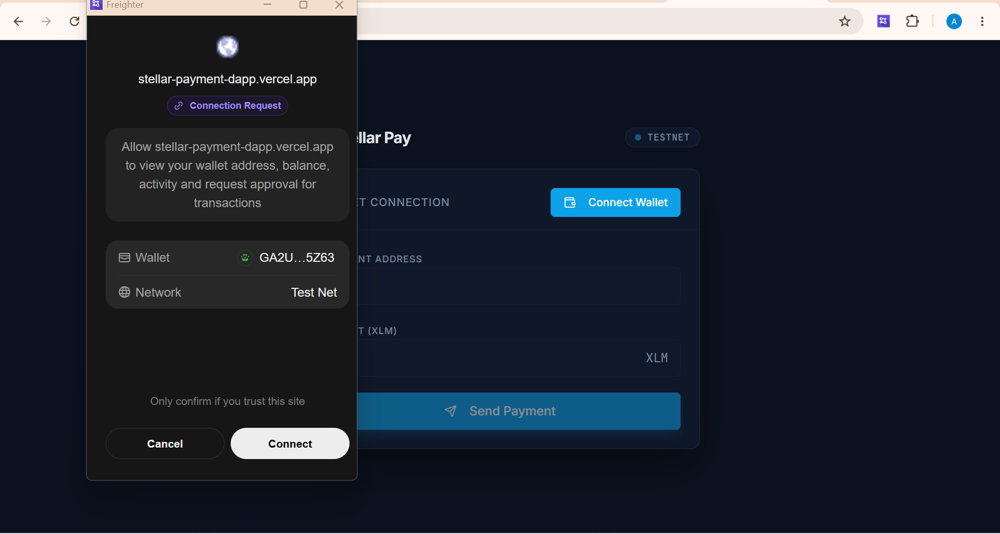
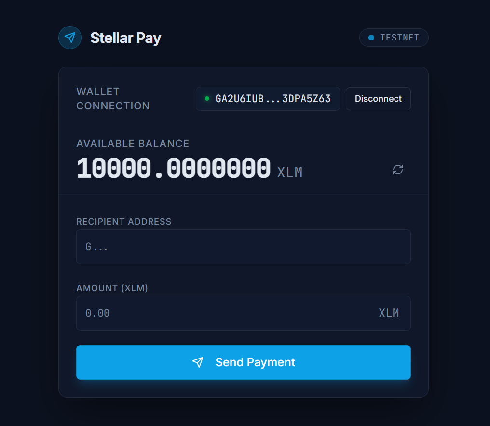
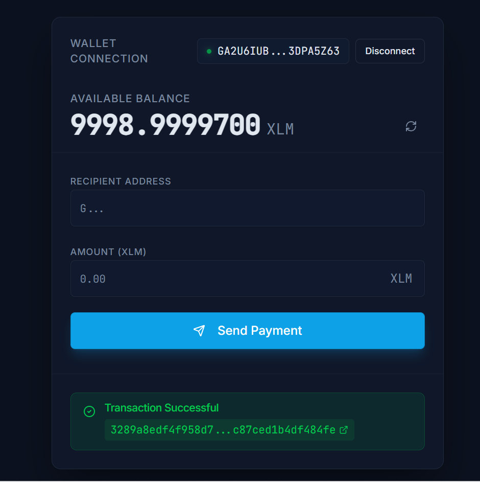

# Stellar Pay — Simple Payment dApp

A beginner-friendly Stellar payment dApp for **White Belt Level 1**. Connect your [Freighter](https://www.freighter.app/) wallet, view your XLM balance on **Stellar Testnet**, and send payments to any address.

**Live demo:** [https://stellar-payment-dapp.vercel.app](https://stellar-payment-dapp.vercel.app)

**Repository:** [https://github.com/rhapy01/Stellar-Payment-Dapp](https://github.com/rhapy01/Stellar-Payment-Dapp)

## Features

- **Wallet connection** — Connect and disconnect Freighter with clear connection status
- **Balance display** — Fetch and show the connected wallet's native XLM balance (with refresh)
- **Send payments** — Transfer XLM on testnet with recipient address and amount inputs
- **Transaction feedback** — Loading state, success with explorer link, and clear error messages
- **Input validation** — Stellar address format, positive amounts, and balance checks

## Prerequisites

- [Node.js](https://nodejs.org/) 18+
- [pnpm](https://pnpm.io/) (`npm install -g pnpm`)
- [Freighter browser extension](https://www.freighter.app/) installed and set to **Testnet**
- Testnet XLM in your wallet ([Stellar testnet faucet](https://laboratory.stellar.org/#account-creator?network=test))

## Setup

```bash
# Clone the repository
git clone <your-repo-url>
cd Stellar-Payment-Dapp

# Install dependencies
pnpm install

# Start the development server
pnpm --filter @workspace/stellar-dapp dev
```

Open [http://localhost:3000](http://localhost:3000) in your browser.

### Deploy to Vercel

The project includes a `vercel.json` at the repo root. Deploy with:

```bash
npx vercel --prod --archive=tgz
```

### Build for production

```bash
pnpm --filter @workspace/stellar-dapp build
pnpm --filter @workspace/stellar-dapp serve
```

## Usage

1. Install Freighter and switch the network to **Testnet** in the extension settings.
2. Fund your account using the [Stellar Laboratory account creator](https://laboratory.stellar.org/#account-creator?network=test) if needed.
3. Click **Connect Wallet** and approve access in Freighter.
4. Your XLM balance appears after connection.
5. Enter a recipient public key (`G...`, 56 characters) and amount, then click **Send Payment**.
6. Approve the transaction in Freighter and view the success message with a link to the transaction on Stellar Expert.

## Screenshots

Add screenshots to `docs/screenshots/` before submitting (wallet connected, balance visible, successful transaction).

| Wallet connected | Balance displayed | Successful transaction |
| --- | --- | --- |
|  |  |  |

## Tech Stack

- React + TypeScript + Vite
- [@stellar/freighter-api](https://www.npmjs.com/package/@stellar/freighter-api) — wallet integration
- [@stellar/stellar-sdk](https://www.npmjs.com/package/@stellar/stellar-sdk) — Horizon API and transaction building
- Tailwind CSS + shadcn/ui components

## Project Structure

```
artifacts/stellar-dapp/
├── src/
│   ├── pages/Home.tsx      # Main dApp UI (wallet, balance, payments)
│   ├── App.tsx             # Router and providers
│   └── components/ui/      # UI components
└── package.json
```

## License

MIT
